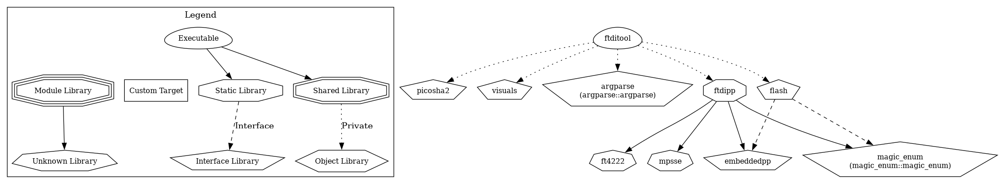

# FTDI Tool
> A C++ implementation for SPI Flash and GPIO leveraging MPSSE-enabled FTDI chips.

`ftditool` is a utility for interfacing with hardware via FTDI chips.

Key featuers:
- Supports **SPI** (serial peripheral interface) and **GPIO** (general-purpose input and output) transactions.
- Compatible with **FT4222** and **FT2232** chips.
- Fast **QuadSPI** support for FT4222 chips.

## Usage guide

`ftditool` can be easily installed using [Nix](https://nix.dev/install-nix.html):

```sh
nix shell github:lowrisc/ftditool
```

Alternatively you can build the tool from yourself by following the developer guide below.

### Arguments

Once built, you can run the tool with the `--help` argument for more information:

```sh
build/ftditool --help
```

**Read JEDEC ID:**

```sh
build/ftditool jedec
```

**Read page 0x8000:**

```sh
build/ftditool read-page --addr 0x8000
```

For an example of a real-world application of `ftditool`, check out the [mocha](https://github.com/lowRISC/mocha/blob/main/util/fpga_runner.py) repository.

## Developer guide

To automatically get an environment where you can build the tool from source you can use Nix.
Run the following command in the root of the repository:

```sh
nix develop
```

You can manually install the dependencies by looking in the "flake.nix" file.


### Build manually

Compiling from source:

```sh
cmake -B build -S ./
cmake --build build
```

### Dependency graph



## Contributing

Feel free to open issues if you have any questions or would like to contribute.
We recommend opening an issue to discuss a contribution before preparing a pull request.

## License

Unless otherwise noted, everything in this repository is covered by the Apache License, Version 2.0.
